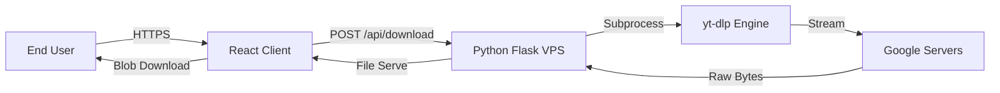

<div align="center">

  

  <br />

  [](https://reactjs.org/)
  [](https://www.typescriptlang.org/)
  [](https://python.org/)
  [](https://tailwindcss.com/)
  [](https://vitejs.dev/)

  <br />
  
  <p align="center">
    <b>Industrial-grade video archival system. Self-hosted. Ad-free. Privacy-first.</b>
    <br />
    <a href="#-features"><strong>Explore the docs »</strong></a>
    <br />
    <br />
    <a href="#-installation">View Demo</a>
    ·
    <a href="https://github.com/yourusername/streamflow/issues">Report Bug</a>
    ·
    <a href="https://github.com/yourusername/streamflow/pulls">Request Feature</a>
  </p>
</div>

---

## ⚡ The Project

**StreamFlow** is not just another YouTube downloader. It is a dedicated extraction infrastructure designed to run on your own Virtual Private Server (VPS). Unlike public converters that are riddled with ads, malware, and compression, StreamFlow delivers the **raw, uncompressed source file** directly from Google's servers to your device via a secure tunnel.

### Why StreamFlow?
Most downloaders process files on overloaded shared servers. StreamFlow utilizes a dedicated backend (powered by `yt-dlp` and `Flask`) to negotiate the video stream, providing:
*   **Zero Compression:** Get the exact bytes uploaded by the creator.
*   **Bypass Restrictions:** Handles age-gated and region-locked content (if the VPS is in a supported region).
*   **Privacy:** No logs. No tracking pixels. No third-party analytics.

---

## 💎 Features

<div align="center">

| Feature | Description | Status |
| :--- | :--- | :---: |
| **4K HDR Support** | Native support for 2160p and high dynamic range content. | ✅ |
| **High-Fidelity Audio** | Extract 320kbps / FLAC audio streams. | ✅ |
| **VPS Tunneling** | Backend proxying bypasses ISP throttling on YouTube. | ✅ |
| **Modern UI** | Glassmorphism design with `Inter` typography and smooth animations. | ✅ |
| **Dark Mode** | "Midnight" OLED-friendly color palette (`#050505`). | ✅ |
| **Auto-Cleanup** | Backend automatically purges cache to manage disk space. | ✅ |

</div>

---

## 🏗 Architecture

The system operates on a decoupled client-server architecture:



---

## 🚀 Installation

### Prerequisites
*   **Node.js** v18+
*   **Python** 3.9+
*   **FFmpeg** (Required for merging video/audio streams)

### 1️⃣ Frontend Setup (The Interface)

```bash
# Clone the repository
git clone https://github.com/yourusername/streamflow.git

# Navigate to root
cd streamflow

# Install dependencies
npm install

# Start Development Server
npm run dev
```

### 2️⃣ Backend Setup (The Engine)

You can run this locally or on a VPS (Recommended).

```bash
# Navigate to backend folder
cd vps-setup

# Create Virtual Environment
python3 -m venv venv
source venv/bin/activate  # On Windows use: venv\Scripts\activate

# Install Python deps
pip install -r requirements.txt

# Run the server
python3 server.py
```

> **Note:** Ensure you have `ffmpeg` installed on your system path.
> *   Ubuntu: `sudo apt install ffmpeg`
> *   Windows: Download binaries and add to PATH.
> *   MacOS: `brew install ffmpeg`

---

## ⚙️ Configuration

To connect the Frontend to the Backend, you must configure the API Endpoint.

1.  Open `src/components/YouTubeDownloader.tsx` (or `components/YouTubeDownloader.tsx`).
2.  Locate the `VPS_API_URL` constant.
3.  Update it to your server's address:

```typescript
// Localhost
const VPS_API_URL = 'http://127.0.0.1:5000';

// Production VPS
const VPS_API_URL = 'http://YOUR_VPS_IP:5000';
```

---

## 📂 Project Structure

```text
streamflow/
├── public/              # Static assets
├── components/          # React UI Components
│   ├── YouTubeDownloader.tsx  # Main Logic
│   ├── Navbar.tsx       # Navigation
│   ├── Footer.tsx       # Status & Links
│   └── LegalDocs.tsx    # Privacy/Terms
├── services/            # API Services
├── types.ts             # TypeScript Interfaces
├── vps-setup/           # Backend Code
│   ├── server.py        # Flask Application
│   ├── requirements.txt # Python Deps
│   └── VPS_GUIDE.md     # Deployment Manual
├── App.tsx              # Routing/Layout
├── index.html           # HTML Entry
├── package.json         # Node Config
└── vite.config.ts       # Build Config
```

---

## 🤝 Contributing

Contributions are what make the open-source community such an amazing place to learn, inspire, and create. Any contributions you make are **greatly appreciated**.

1.  Fork the Project
2.  Create your Feature Branch (`git checkout -b feature/AmazingFeature`)
3.  Commit your Changes (`git commit -m 'Add some AmazingFeature'`)
4.  Push to the Branch (`git push origin feature/AmazingFeature`)
5.  Open a Pull Request

---

## 📜 License

Distributed under the MIT License. See `LICENSE` for more information.

---

<div align="center">
  <p>
    Built with ❤️ by <b>StreamFlow Systems</b>
  </p>
  
</div>
